# Bus-Terminal-Signs

1. [Hardware details](#hardware-details)
2. [Software details](#software-details)
3. [Setup](#setup)
   1. [The parts involved](#the-parts-involved)
      1. [Daisy-chaining](#daisy-chaining)
   2. [Solder wires to ribbon cable](#solder-wires-to-ribbon-cable)
      1. [Pin designation](#pin-designation)
   3. [Connect the sign to an Arduino](#connect-the-sign-to-an-arduino)
      1. [Breadboard](#breadboard)
      2. [Other setup images](#other-setup-images)
   4. [Program Arduino with code](#program-arduino-with-code)
   5. [Next steps](#next-steps)
4. [If it doesn't work](#if-it-doesnt-work)
   1. [The display doesn't display anything](#the-display-doesnt-display-anything)
   2. [The display flashes pixels randomly](#the-display-flashes-pixels-randomly)
   3. [Something else](#something-else)

Everything we found out about these signs and Arduino code to drive them.

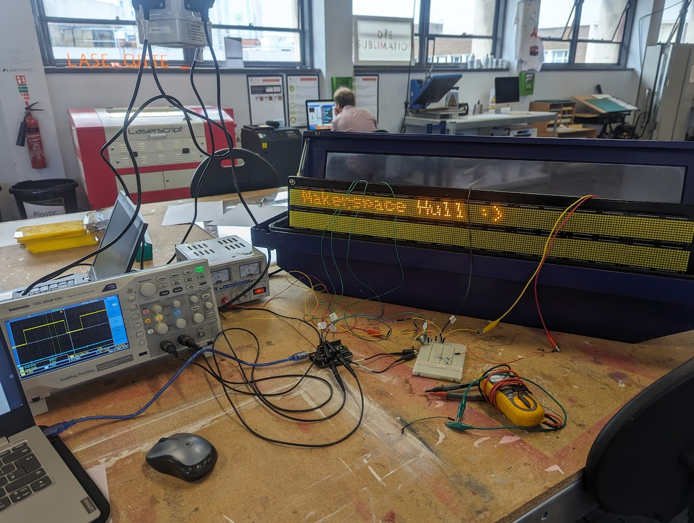

## Hardware details

- See [Hardware.md](./Hardware.md).
- See [below](#the-parts-involved)
- [Datasheets](./Datasheets/)
- [SPI](./SPI.md)

## Software details

- [Code for using the panels](./Code/)
- [Code examples](./Code/Examples/)

## Setup

If you have access to a sign, you should be able to set it up to display text with just an Arduino, a power supply, and some soldering.

### The parts involved

This is a list of components involved with the signs, as well as terms for parts together (unit/display/etc).

| Common name | Part number (& datasheet) | Description |
| --- | --- | --- |
| Unit | N/A | The whole thing. |
| LED Panel | unknown | A single panel of 24 x 9 LEDs. |
| Display | N/A | All the panels together, 8 x 2. |
| Display Row | N/A | One row of 8 LED Panels. |
| Panel PCB | unknown | The PCBs that the panels are attached to. On the unit, there are three of these. Two hold 6 LED Panels (3 x 2), and one holds 4 LED Panels (2 x 2). |
| Ribbon Cable | unknown | The ribbon cable connecting the Panel PCB(s) to the logic. This is where we attach to the system. |
| AS1100 chip | [AS1100] | A microchip used to control 7 segment displays or (in this case) dot matrix displays. There is one of these per 6 x 8 LED pixels, so 4 per LED Panel, or 32 across one display row. |
| AC to DC Power Converter | unknown | This takes mains power and outputs 5 V, (up to) 20 A DC, which is used by the back-of-unit logic, and to power the LEDs in the panel. The AS1100 chips do not use this power. We can attach a power supply to the DC output terminal instead of using mains power. There are two positive and two ground cables, but these are in-fact one of each (in a loop) for redundancy. |
| Back-of-unit logic | unknown | This is a collective term for the boards behind the display. These expose an Ethernet port for interfacing, which we cannot use as we do not know the HTTP requests that the unit requires. Thus, we do not use it and instead inject our Arduino into the ribbon cable. |
| DMX PCB | unknown | This is part of the back-of-unit logic. We use it in lieu of a proper ribbon cable connector, by soldering onto the terminal. |

[AS1100]: ./Datasheets/AS1100_DS000273_1-00.pdf

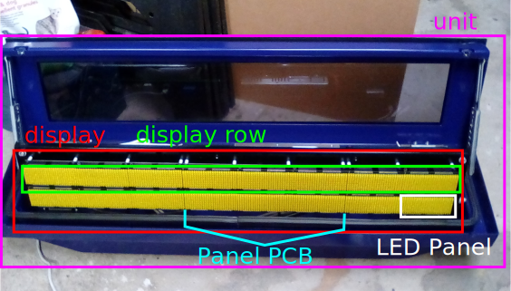

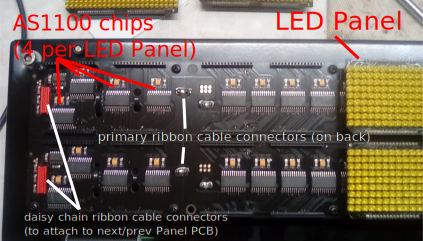

#### Daisy-chaining

The AS1100 chips are daisy-chained, like in the [datasheet][AS1100]. Each controls a sub-matrix of pixels. This means that if we want to talk to a specific one (to send a specific digit) we have to send 32 messages (one per chip - for a total of 32 characters).

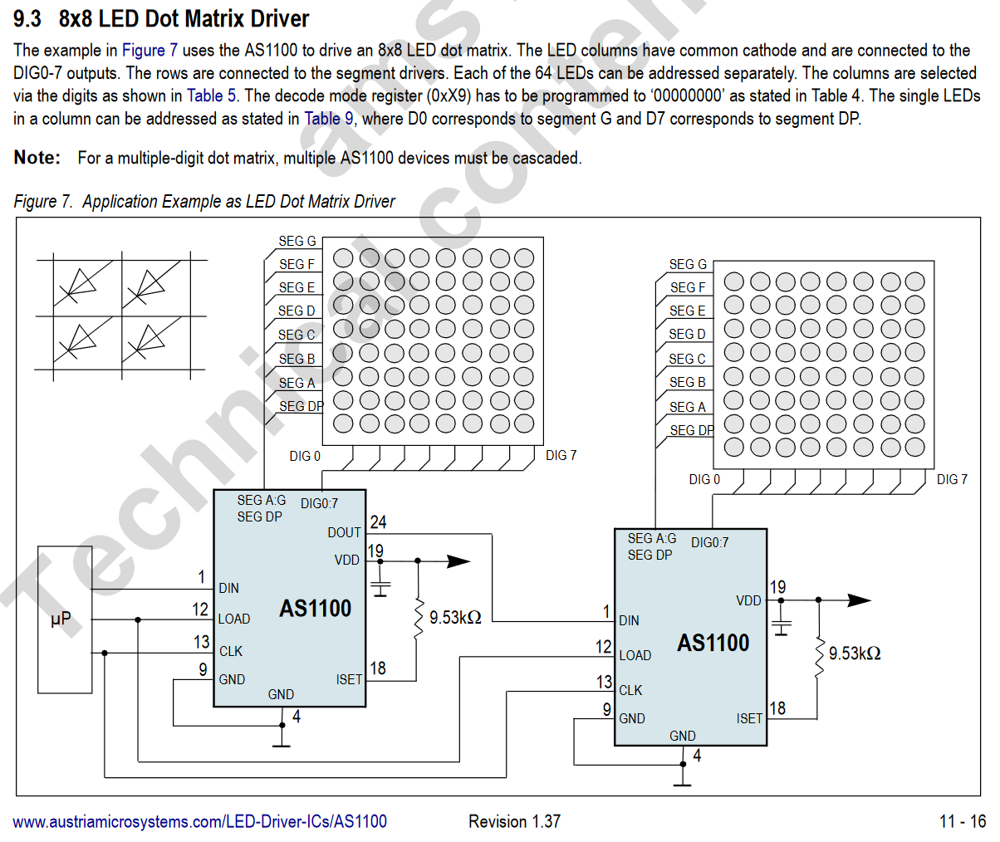

### Solder wires to ribbon cable

We need to connect to the AS1100 chips to send data based on the information from the [datasheet][AS1100]. The signals we need to send data to the AS1100 chips are:

- DATA pin, to send data with SPI protocol
- CLOCK pin, for SPI protocol
- LOAD pin, for SPI protocol
- ISET pin, for setting LED voltage
- GROUND pin

We can do this via the exposed ribbon cables, noting that:

- The `CLOCK` and `LOAD` pins are inverted by the Panel PCBs, so we must invert our signal to what the [datasheet][AS1100] says for these two pins. The `DATA` pin remains unchanged.

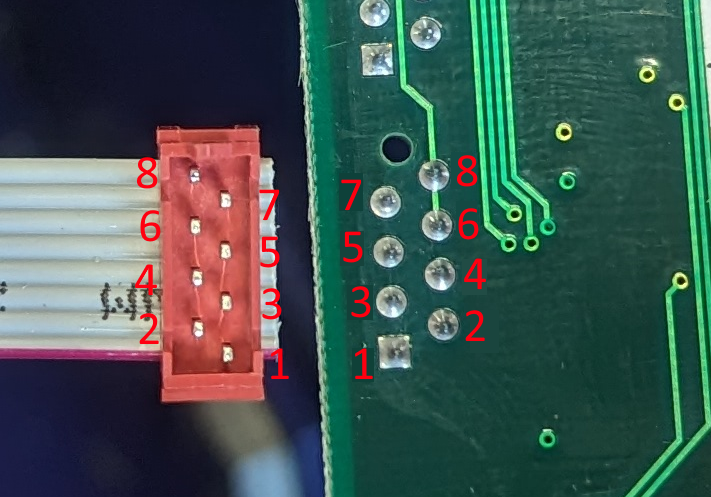

#### Pin designation

In relation to the [AS1100], these pins are:

|| Pin | Name | Use | Required here? |
| --- | --- | ---- | --- | ---------------- |
|🟥| 1 | NC |||
|| 2 | ISET | The voltage on ISET is the voltage across each LED. | ✅ |
|| 3 | LOAD | A falling edge of LOAD triggers the AS1100 to read the most recent SPI transmission (see [datasheet][AS1100], section 8.1). | ✅ |
|| 4 | DOUT | Data OUT, this is a delayed DIN, used for daisy-chaining (see [datasheet][AS1100], 8.1, 9.2). ||
|| 5 | CLK | Clock pin, inverted, for SPI. See [datasheet][AS1100], section 8.1. | ✅ |
|| 6 | GND | Ground. | ✅ |
|| 7 | DIN | Data IN. This is used to send data to the panel. See [datasheet][AS1100], section 8.1. ||
|| 8 | GND | Ground. | ✅ |

Thus, to connect to a row of the display, we can plug the ribbon cable into the DMX PCB and solder onto the back.

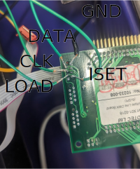

### Connect the sign to an Arduino

We connect the DMX board to an Arduino to communicate with it, as well as attaching all things to power that require it. Connect LOAD to 7 (or whatever is defined in code), CLK to pin 13 (or your Arduino's SPI clock pin), DATA to pin 11 (or your Arduino's SPI MOSI pin).

Note this Arduino must be capable of outputting 5 V.

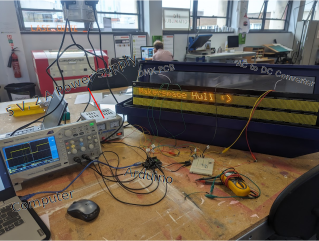

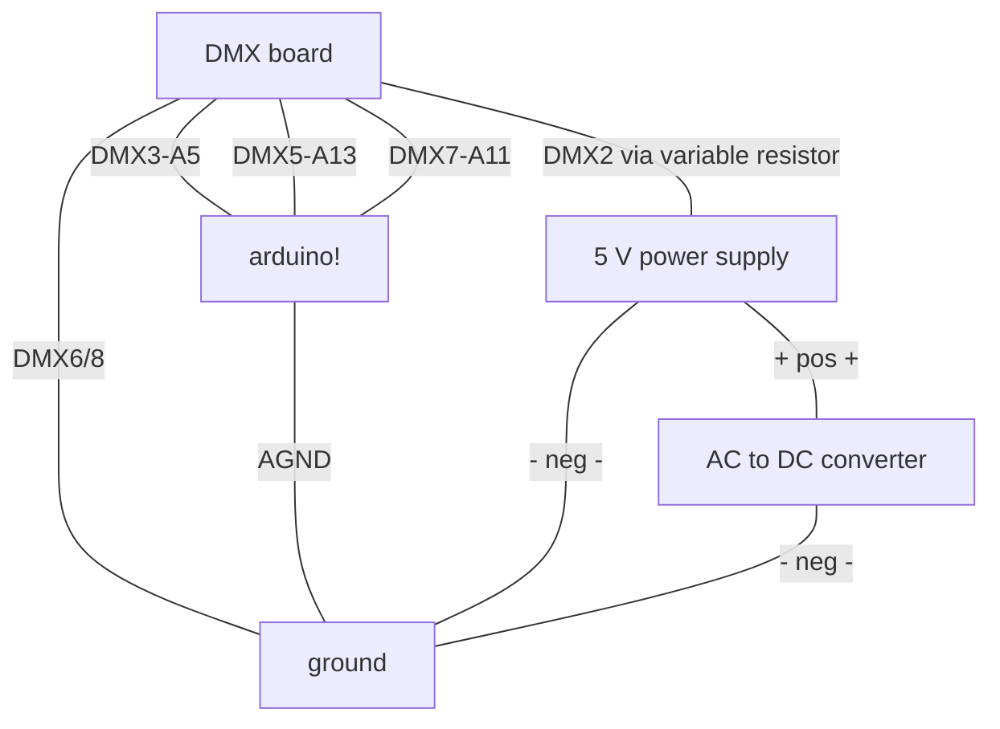

#### Breadboard

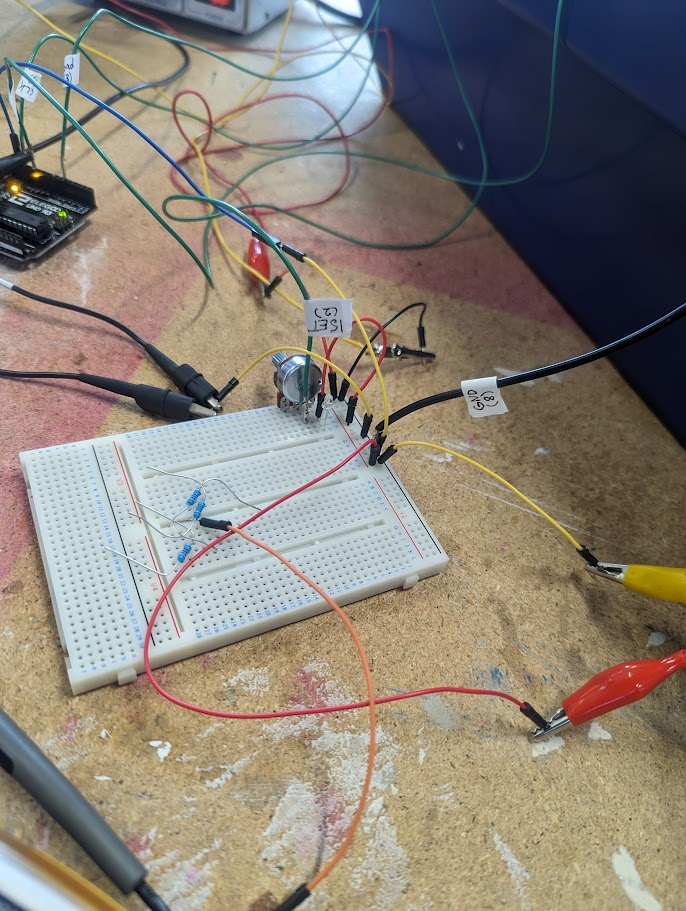

#### Other setup images

See other setup images

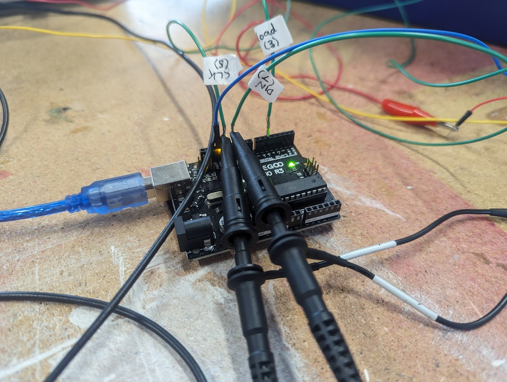

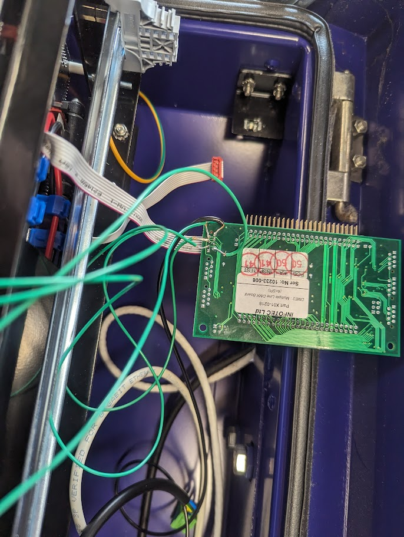

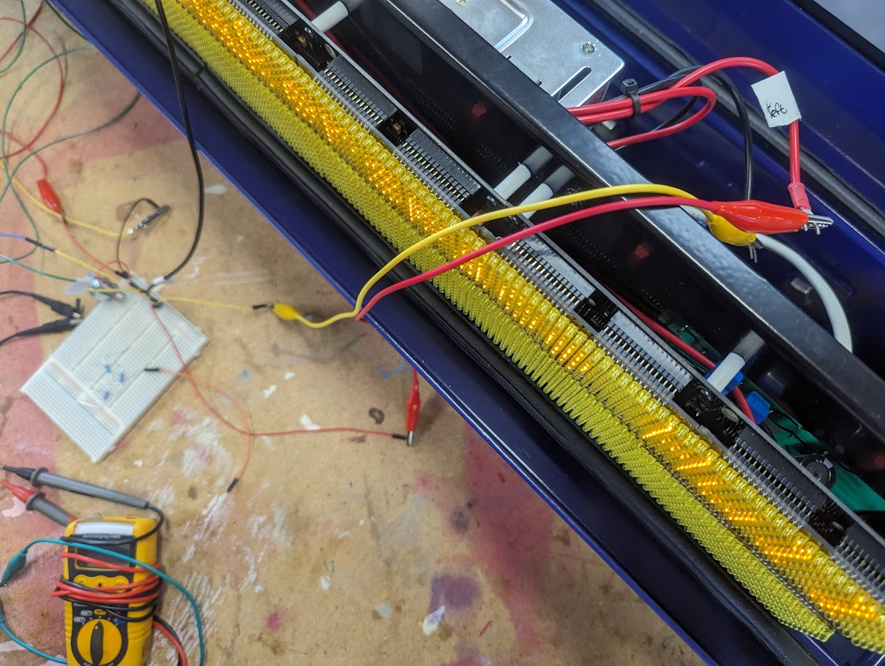

### Program Arduino with code

- Download the [Arduino IDE 2](https://docs.arduino.cc/software/ide-v2).
- Copy [`CH_AS1100.h`] and [`CH_AS1100.cpp`][`CH_AS1100.h`] to `C:\Users\<user>\Documents\Arduino\libraries\ConnectedHumber`
  (or [create a symbolic link](./Code/README.md#using-code))
- Create a Sketchbook with the [example code]
- The pins at the top of the code should match where you put them, and there are 2 chips per LED panel, so 32 across the width of a full sign.
- Upload code to Arduino
- Power on display with power supply
- Press reset button on Arduino to start program!

### Next steps

Hopefully that worked :)

If it didn't, see [below](#if-it-doesnt-work).

If you want to write your own code building on the examples, you can see code documentation [online](https://ConnectedHumber.github.io/Bus-Terminal-Signs) (or [in the code](./Code/CH_AS1100.cpp)).

[`CH_AS1100.h`]: ./Code
[example code]: ./Code/Examples/Scrolling%20Text%20Demo.ino

## If it doesn't work

### The display doesn't display anything

- Check connections (no pins touching etc) with a multimeter (on continuity test mode)
- Check SPI is sending to clock and data pins with oscilloscope
  - You can use the sketch [spi_test](./Code/Examples/spi_test.ino) to send a very simple repeated SPI signal to test.
- Check load signal sends on load pin

### The display flashes pixels randomly

- Check that everything is grounded to the same ground
- Use the [display test](./Code/Examples/display_test.ino) sketch to see if the display is accepting instructions
- Check that SPI signal is from 0V to 5V (with oscilloscope)

### Something else

- [Create an issue](https://github.com/ConnectedHumber/Bus-Terminal-Signs/issues) in this repository, and maybe we can help
